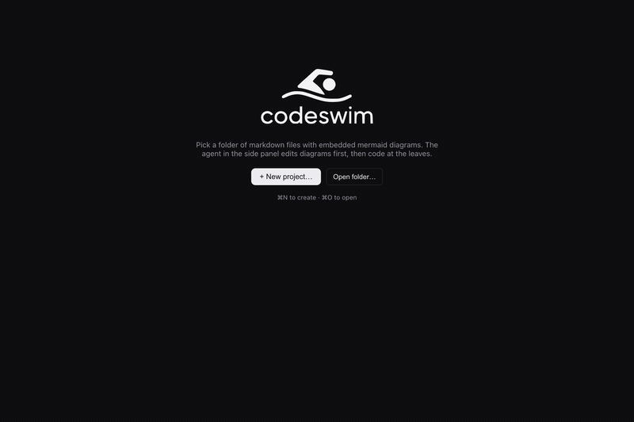
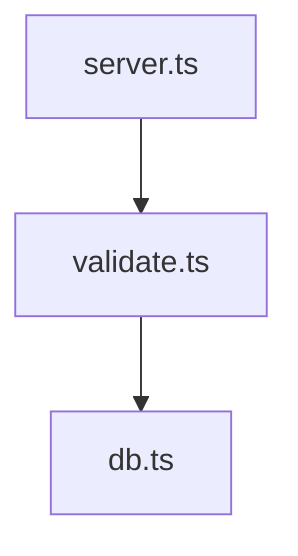

<p align="center">
  
</p>

<p align="center">
  Browse a codebase as a hierarchy of mermaid diagrams.
  The diagrams are the spec; the code is what implements them.
</p>

<p align="center">
  <em>“You can outsource your thinking, but you can't outsource your understanding.”</em><br>
  — Andrej Karpathy
</p>

<p align="center">
  
</p>

---

## What it is

codeswim is a desktop app (Electron) that opens a folder and renders the markdown files inside it as a navigable diagram tree. Click a node to drill into a child diagram or read the companion explanation for the source file it represents. An AI agent panel keeps the diagrams aligned with the code as you change either side.

## Try it

Point codeswim at [codeswim-example](https://github.com/keithagroves/codeswim-example) — a small runnable demo codebase with an `overview.md` at the root and a full diagram tree underneath. That's the fastest way to see what the format looks like in practice.

## The format

Every diagram lives in a markdown file with three parts: YAML frontmatter, a short prose paragraph, and exactly one mermaid block.

````markdown
---
name: API surface
description: HTTP routes exposed by the server
---

The server registers routes lazily. Validation lives in `validate.ts`;
persistence lives in `db.ts`.



## Source

- `../src/server.ts` — HTTP entry point, route table
- `../src/validate.ts` — request validation
- `../src/db.ts` — Postgres queries
````

### Rules

|                                                |                                                                                                                                               |
| ---------------------------------------------- | --------------------------------------------------------------------------------------------------------------------------------------------- |
| **One mermaid block per file**                 | The renderer only shows the first one. Extra blocks are ignored.                                                                              |
| **Frontmatter is required**                    | `name` and `description`. The description shows up in tooltips and tree views — make it specific.                                             |
| **Every flowchart node needs a click handler** | `click NodeId call navigate("…")`. If a node has no obvious target, point at the parent diagram or `overview.md`.                             |
| **`click` is flowchart-only**                  | Sequence/class/state/ER diagrams don't support it. For those, put the links in the prose below as bullets.                                    |
| **Source leaves are explanations**             | A link to `src/server.ts` renders `.codeswim/explanations/src/server.ts.md`. Use **Open in editor** when the implementation itself is needed. |
| **Link to files, not directories**             | `[migrations](../src/db/migrations/)` is broken — point at a representative file inside instead.                                              |
| **Architecture docs have a Source section**    | A bulleted list of the files the diagram covers with a one-line role each. Makes coverage auditable.                                          |

### Click target resolution

- Targets ending in `.md` open as another diagram and push a breadcrumb.
- Source-file targets render their companion Markdown explanation.
- The actual implementation opens only through **Open in editor**.

### Layering convention

The only hard requirement is **`overview.md` at the workspace root** — coverage uses it as the entry for reachability. Beyond that, use whatever folder structure the project already has. For brand-new projects, the defaults are:

- `overview.md` — one diagram of the system's subsystems
- `architecture/<subsystem>.md` — structure diagrams with a Source list
- `flows/<flow>.md` — sequence/flowchart diagrams for specific request flows
- `decisions/adr-<n>-<slug>.md` — ADRs explaining _why_
- `.codeswim/explanations/<source-path>.md` — explanations for directly navigable source files

## Running locally

```bash
npm install
npm run dev        # electron-vite dev server with HMR
```

## Building installers

```bash
npm run build:mac      # → apps/desktop/dist/codeswim-<version>.dmg
npm run build:win      # → apps/desktop/dist/codeswim-<version>-setup.exe
npm run build:linux    # → apps/desktop/dist/codeswim-<version>.AppImage, .snap, .deb
```

A push of a `v*` tag triggers `.github/workflows/release.yml`, which builds on all three OSes and uploads to a GitHub draft release.

## Related

- [codeswim-vscode](https://github.com/keithagroves/codeswim-vscode) — same idea as a VS Code extension; ships a `codeswim-coverage` CLI for checking diagram/code alignment.
- [codeswim-example](https://github.com/keithagroves/codeswim-example) — a small demo codebase to point the navigator at.
