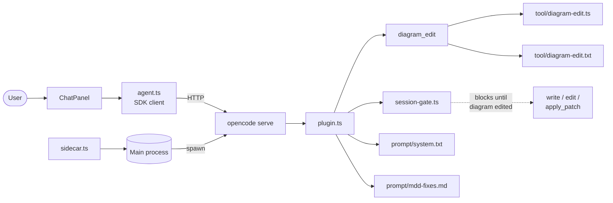

The harness is what turns codeswim from a passive diagram viewer into a
diagram-first agent loop. The main process spawns `opencode serve` as a
sidecar with our plugin loaded; the renderer's chat panel talks to it via
the `@opencode-ai/sdk` client. The plugin registers a `diagram_edit` tool
and gates `write`/`edit`/`apply_patch` behind a per-session check — the
agent has to touch a diagram before it can touch code. That's the
mechanical enforcement of the MDD rules; the system prompt and
`mdd-fixes.md` carry the soft guidance.

## Notes

- The sidecar config is passed via `OPENCODE_CONFIG_CONTENT` (JSON in an env var) so we never write to the user's workspace or their global `opencode` config.
- In packaged builds, `opencode-ai`, the platform-specific opencode binary package, and `out/harness` are `asarUnpack`'d so the plugin can be loaded by `file://` URL.
- `session-gate.ts` is in-memory only — sessions reset gate state on restart, which is fine because each chat session also re-runs the system prompt.
- The renderer-side `agent.ts` wraps the SDK client with session list/load/create so the chat panel can switch between past sessions for a workspace.

## Source

- [src/main/sidecar.ts](../src/main/sidecar.ts) — spawns and supervises the `opencode serve` subprocess.
- [src/harness/plugin.ts](../src/harness/plugin.ts) — opencode plugin entry; registers `diagram_edit` and the tool-call gate hook.
- [src/harness/session-gate.ts](../src/harness/session-gate.ts) — per-session "has a diagram been edited yet?" state used by the gate.
- [src/harness/tool/diagram-edit.ts](../src/harness/tool/diagram-edit.ts) — pure implementation of the `diagram_edit` tool (frontmatter check, mermaid block check, file write).
- [src/harness/tool/diagram-edit.txt](../src/harness/tool/diagram-edit.txt) — tool description shown to the model.
- [src/harness/prompt/system.txt](../src/harness/prompt/system.txt) — system prompt that teaches the diagrams-first loop.
- [src/harness/prompt/mdd-fixes.md](../src/harness/prompt/mdd-fixes.md) — additional MDD repair guidance the agent loads when fixing drift.
- [src/renderer/src/agent.ts](../src/renderer/src/agent.ts) — renderer-side session-aware SDK wrapper.
- [src/renderer/src/components/ChatPanel.tsx](../src/renderer/src/components/ChatPanel.tsx) — the chat UI itself.
