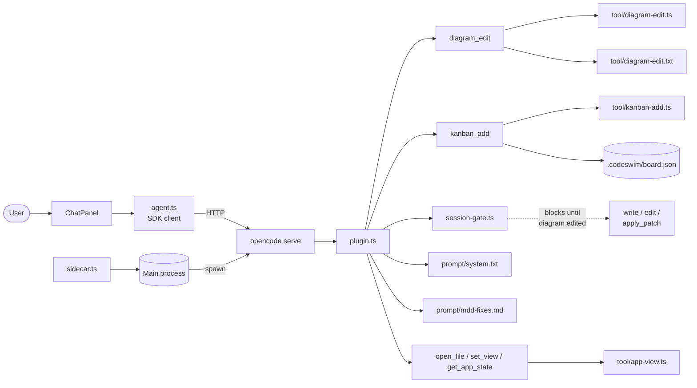

The harness is what turns codeswim from a passive diagram viewer into a
diagram-first agent loop. The main process spawns `opencode serve` as a
sidecar with our plugin loaded; the renderer's chat panel talks to it via
the `@opencode-ai/sdk` client. The plugin registers a `diagram_edit` tool
and gates `write`/`edit`/`apply_patch` behind a per-session check — the
agent has to touch a diagram before it can touch code. That's the
mechanical enforcement of the MDD rules; the system prompt and
`mdd-fixes.md` carry the soft guidance. The plugin also registers a
`kanban_add` tool so the agent can drop tasks onto the project board
(`.codeswim/board.json`) — the board is agent-populated, not hand-curated.

## Notes

- The sidecar config is passed via `OPENCODE_CONFIG_CONTENT` (JSON in an env var) so we never write to the user's workspace or their global `opencode` config.
- In packaged builds, `opencode-ai`, the platform-specific opencode binary package, and `out/harness` are `asarUnpack`'d so the plugin can be loaded by `file://` URL.
- `session-gate.ts` is in-memory only — sessions reset gate state on restart, which is fine because each chat session also re-runs the system prompt.
- The renderer-side `agent.ts` wraps the SDK client with session list/load/create so the chat panel can switch between past sessions for a workspace.

## Source

- [apps/desktop/src/main/sidecar.ts](../apps/desktop/src/main/sidecar.ts) — spawns and supervises the `opencode serve` subprocess.
- [packages/harness/src/plugin.ts](../packages/harness/src/plugin.ts) — opencode plugin entry; registers `diagram_edit` and the tool-call gate hook.
- [packages/harness/src/session-gate.ts](../packages/harness/src/session-gate.ts) — per-session "has a diagram been edited yet?" state used by the gate.
- [packages/harness/src/tool/diagram-edit.ts](../packages/harness/src/tool/diagram-edit.ts) — pure implementation of the `diagram_edit` tool (frontmatter check, mermaid block check, file write).
- `packages/harness/src/tool/diagram-edit.txt` — tool description shown to the model.
- [packages/harness/src/tool/kanban-add.ts](../packages/harness/src/tool/kanban-add.ts) — pure implementation of the `kanban_add` tool (reads/normalizes `.codeswim/board.json`, appends a card, writes it back). Reuses the shared kanban normalizer so the agent and UI write identical board files.
- `packages/harness/src/tool/kanban-add.txt` — `kanban_add` tool description (reference; the live description is inlined in `plugin.ts`).
- [packages/harness/src/tool/app-view.ts](../packages/harness/src/tool/app-view.ts) — shared validation and state formatting for `open_file`, `set_view`, and `get_app_state` tools.
- `packages/harness/src/prompt/system.txt` — system prompt that teaches the diagrams-first loop.
- [packages/harness/src/prompt/mdd-fixes.md](../packages/harness/src/prompt/mdd-fixes.md) — additional MDD repair guidance the agent loads when fixing drift.
- [apps/desktop/src/renderer/src/agent.ts](../apps/desktop/src/renderer/src/agent.ts) — renderer-side session-aware SDK wrapper.
- [apps/desktop/src/renderer/src/components/ChatPanel.tsx](../apps/desktop/src/renderer/src/components/ChatPanel.tsx) — the chat UI itself.

### Testing

- [packages/harness/src/tool/kanban-add.test.ts](../packages/harness/src/tool/kanban-add.test.ts) — covers the kanban_add tool implementation.
- [packages/harness/src/tool/app-view.test.ts](../packages/harness/src/tool/app-view.test.ts) — covers path/view validation and app state formatting.
- [packages/harness/src/plugin.test.ts](../packages/harness/src/plugin.test.ts) — covers the opencode plugin entry point and tool registration.
