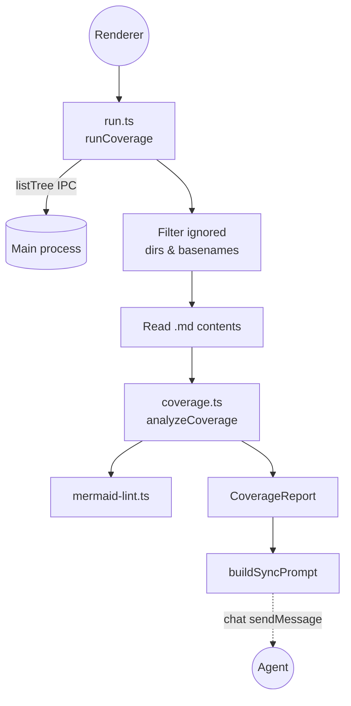

Coverage is the feedback loop that makes MDD enforceable instead of
aspirational. It walks the workspace tree, reads every `.md` file,
extracts links and click handlers from mermaid blocks, and produces a
`CoverageReport` listing four kinds of drift: links that resolve to
nothing, diagrams not reachable from `overview.md`, source files not
referenced from any diagram, and mermaid blocks that fail to parse.
The report can also be formatted into a self-contained prompt the
[agent harness](./agent-harness.md) acts on.

## Notes

- Coverage runs in the renderer, not as a standalone CLI — it leans on the existing `listTree` and `readFile` IPC instead of duplicating filesystem code in a Node script.
- `coverage.ts` is pure: it takes `FileInfo[]` (path + content) and returns a report. That makes it trivially testable and reusable from anywhere.
- Non-markdown files are passed in with empty content; only diagrams need their text read.
- `buildSyncPrompt` deliberately doesn't prescribe fixes — the [system prompt](../src/harness/prompt/system.txt) and [mdd-fixes.md](../src/harness/prompt/mdd-fixes.md) already encode the MDD rules, so the prompt just enumerates the drift and lets the agent pick the right fix per item.

## Source

- [src/renderer/src/coverage/run.ts](../src/renderer/src/coverage/run.ts) — workspace walker, file filter, prompt formatter.
- [src/renderer/src/coverage/coverage.ts](../src/renderer/src/coverage/coverage.ts) — the pure `analyzeCoverage` function and report types.
- [src/renderer/src/coverage/mermaid-lint.ts](../src/renderer/src/coverage/mermaid-lint.ts) — mermaid block syntax linting used inside the analyzer.
