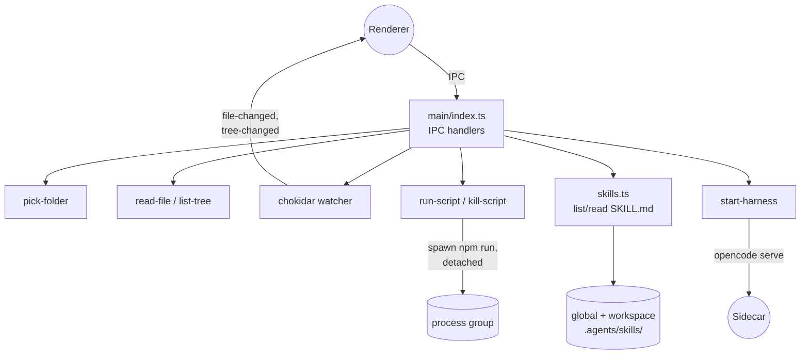

The main process is the only side of the app that touches the filesystem
directly. It registers every IPC handler the renderer can call, watches
the picked workspace for changes, spawns npm scripts in detached process
groups so their grandchildren can be killed cleanly, and indexes user
skill files. Spawning the `opencode` sidecar also originates here — see
the [Agent harness](./agent-harness.md) doc for that flow.

## Notes

- IPC handler names are the contract; they must match what the [preload bridge](./preload.md) exposes.
- The watcher debounces `tree-changed` at 200ms because editors fire multiple events per save (rename + write).
- Script names are validated against parsed `package.json` scripts before spawning, then shell-quoted.
- The `detached: true` flag matters: `npm run foo` itself spawns grandchildren (e.g. `tsx`, `vitest`); without a process group we'd leak them on stop.

## Source

- [apps/desktop/src/main/index.ts](../apps/desktop/src/main/index.ts) — process entry, BrowserWindow, every IPC handler, chokidar watcher, npm script runner.
- [packages/domain-skills/src/skills.ts](../packages/domain-skills/src/skills.ts) — discovers global + workspace SKILL.md files and exposes a read API to the renderer.
- [packages/domain-kanban/src/kanban.ts](../packages/domain-kanban/src/kanban.ts) — Kanban board read/write and GitHub issue sync.
- [packages/domain-github/src/pull-requests.ts](../packages/domain-github/src/pull-requests.ts) — GitHub pull request listing and merging via the API.
- [packages/domain-github/src/room.ts](../packages/domain-github/src/room.ts) — room identity management for chat.
- [packages/domain-skills/src/source-explanations.ts](../packages/domain-skills/src/source-explanations.ts) — companion explanation path resolution and read.
- [packages/domain-skills/src/agents-doc.ts](../packages/domain-skills/src/agents-doc.ts) — reads and writes AGENTS.md files (workspace scope and global ~/.agents/ scope).
- [packages/domain-skills/src/index.ts](../packages/domain-skills/src/index.ts) — domain-skills package entry point.
- [apps/desktop/src/main/github.ts](../apps/desktop/src/main/github.ts) — GitHub OAuth device-flow handler in the main process.
- [packages/domain-github/src/github-auth.ts](../packages/domain-github/src/github-auth.ts) — GitHub OAuth device-flow authentication for the chat feature.
- [packages/domain-github/src/index.ts](../packages/domain-github/src/index.ts) — domain-github package entry point.
- [packages/domain-kanban/src/index.ts](../packages/domain-kanban/src/index.ts) — domain-kanban package entry point.
- [packages/contract/src/chat.ts](../packages/contract/src/chat.ts) — shared chat types used by main and renderer.
- [packages/contract/src/kanban.ts](../packages/contract/src/kanban.ts) — shared kanban types used by main and renderer.
- [packages/contract/src/index.ts](../packages/contract/src/index.ts) — contract package entry point.

### Testing

- [packages/domain-kanban/src/kanban.test.ts](../packages/domain-kanban/src/kanban.test.ts) — covers the main-process kanban operations.
- [packages/domain-github/src/room.test.ts](../packages/domain-github/src/room.test.ts) — covers the room identity logic.
- [packages/domain-skills/src/source-explanations.test.ts](../packages/domain-skills/src/source-explanations.test.ts) — covers explanation path resolution.
