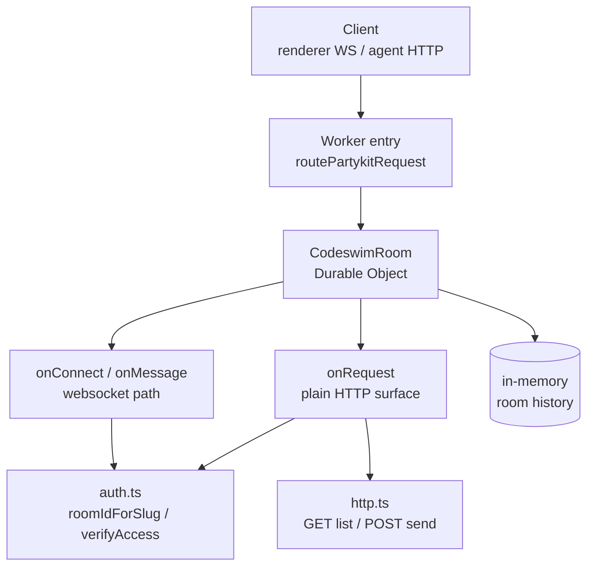

The party server is the backend that powers codeswim's per-project chat.
It deploys as a plain Cloudflare Worker to your own account's
`*.workers.dev` subdomain via `wrangler deploy` (see
[wrangler.jsonc](../wrangler.jsonc)); locally it runs with `wrangler dev`
on port 8788. Every repo gets two rooms — a `public` room (always open,
display-name only) and a `collab` room (GitHub-collaborator-gated when
the `REQUIRE_AUTH` env var is set). Room ids are SHA-256 digests of the
repo's origin remote (see `roomIdForSlug` in
[domain-github](../packages/domain-github/src/room.ts)), so two clones of
the same repo connect to the same room with no central registry.

The renderer's [RoomChatPanel](../apps/desktop/src/renderer/src/components/RoomChatPanel.tsx)
holds a websocket open to a room; the in-app agent's `chat_read` /
`chat_send` tools (see [Agent harness](./agent-harness.md)) use the room's
plain-HTTP surface instead so a one-shot tool call needs no websocket.

## Notes

- The Durable Object (`CodeswimRoom`) runs with `hibernate: false` so
  in-memory history and presence survive while connections are alive;
  history is not persisted to storage yet.
- `mode=public` rooms admit immediately regardless of `REQUIRE_AUTH`; the
  client still sends `?slug=` so the worker can confirm `hash('public:' +
slug)` actually matches the room being joined.
- `mode=collab` rooms hold the connection until an `{type:'auth', token,
slug}` frame arrives (10s timeout). The token travels in a message, never
  the URL, so it stays out of edge logs.
- `party/auth.ts` and `party/http.ts` are pure (Web Crypto + `fetch`, no
  `partyserver`/`cloudflare:` imports) so they unit-test under plain Node.
- Message ordering has a single writer: both the websocket `chat` frame and
  the HTTP POST funnel through `CodeswimRoom.postMessage`.

## Source

- [party/codeswim.ts](../party/codeswim.ts) — the PartyServer worker: routes `/parties/codeswim-room/:roomId` to a per-room Durable Object, implements websocket admission (public vs auth-gated), chat/viewing messages, and in-memory history.
- [party/auth.ts](../party/auth.ts) — pure room-id hashing (`roomIdForSlug`) and GitHub collaborator verification (`verifyAccess`), shared by the websocket and HTTP paths.
- [party/http.ts](../party/http.ts) — pure decision logic for the room's plain GET/POST surface, consumed by `CodeswimRoom.onRequest`.
- [wrangler.jsonc](../wrangler.jsonc) — Cloudflare Workers config: worker entry, `CodeswimRoom` Durable Object binding + migration, `REQUIRE_AUTH` default, dev port 8788.

### Testing

- [party/codeswim.test.ts](../party/codeswim.test.ts) — covers the worker's admission/auth/room-mismatch logic against a fake Server/Connection.
- [party/http.test.ts](../party/http.test.ts) — covers the plain-HTTP GET/POST decision logic (room mismatch, auth gating, message shaping).
