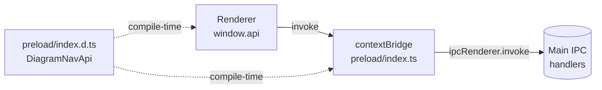

Preload is the narrowest layer of the app. It runs in an isolated world,
exposes a small `window.api` object to the renderer via `contextBridge`,
and forwards calls through `ipcRenderer.invoke` to the
[main process](./main-process.md). Because the renderer keeps
`contextIsolation: true` and `nodeIntegration: false`, this is the only
way it can reach the filesystem or spawn subprocesses.

## Notes

- The IPC contract is the `DiagramNavApi` interface in
  [index.d.ts](../src/preload/index.d.ts). Adding a method requires
  touching all three processes — preload exposes it, main handles it,
  renderer calls it.
- The bridge also wires event subscriptions (`onFileChanged`,
  `onTreeChanged`, harness streams) as `(listener) => unsubscribe`
  closures so React effects can clean up.

## Source

- [src/preload/index.ts](../src/preload/index.ts) — the actual `contextBridge.exposeInMainWorld` call and all IPC forwarders.
- [src/preload/index.d.ts](../src/preload/index.d.ts) — types for `window.api`, IPC payloads, and the event subscription signatures.
