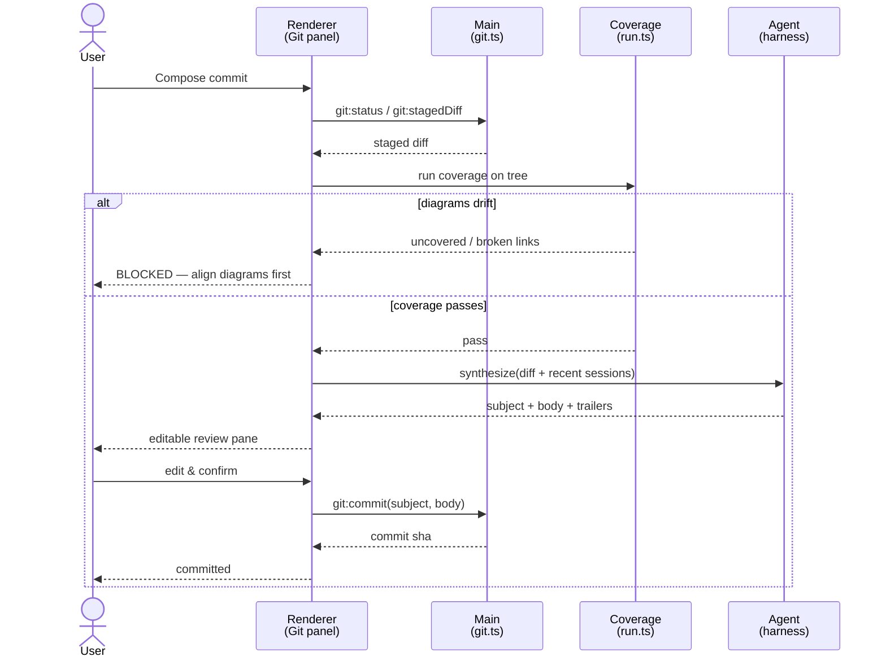
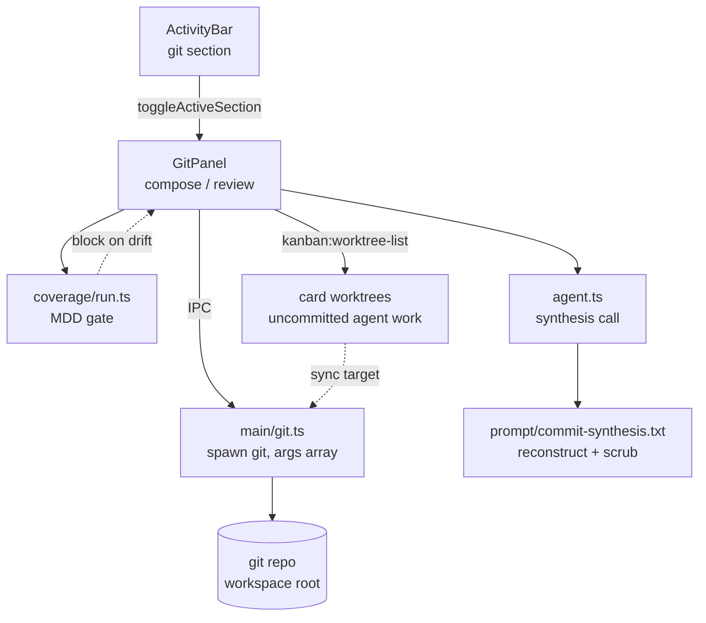

> **Status: phase 1 shipped.** The diff-first vertical slice is implemented:
> a Commit section in the activity bar that gates on coverage, synthesizes
> the commit message from the staged diff, lets the user edit it, and
> commits. Phase 2 (session enrichment + regex secret-scrub pre-pass) is
> still pending. One deviation from the original plan: the synthesis
> _prompt_ is built in a renderer module ([commit/synthesize.ts](../packages/commit/src/synthesize.ts)),
> mirroring `buildSyncPrompt`, rather than a `commit-synthesis.txt` harness
> file — it is a per-commit user prompt, not a system prompt.

## Thesis

[plan.md](../plan.md) argues that as AI generates the implementation,
humans should curate **intent**, not generated output. Codeswim already
applies that to _reading_ a codebase (diagrams-as-navigation). Prompt
commits apply the same move to _history_: a commit message stops being
"what bytes changed" and becomes **the prompt that would regenerate this
diff**. Same artifact — captured intent — at a different altitude.

The commit message is a **specification record**, not a migration. LLM
generation is non-deterministic and model-versioned, so replaying a
message regenerates _equivalent_ code, never byte-identical code. We sell
it as executable intent (a human or agent could reconstruct equivalent
code from it), not as a deterministic, reversible migration.

## Decisions locked

| Decision                | Choice                          | Consequence                                                                                                                                                                  |
| ----------------------- | ------------------------------- | ---------------------------------------------------------------------------------------------------------------------------------------------------------------------------- |
| Prompt source           | **Diff-first, sessions enrich** | Always synthesize from the staged diff; pull recent in-workspace agent sessions in as evidence when they exist. Hand-written commits still get a spec.                       |
| Replay ambition (v1)    | **Spec record only**            | The message is a high-quality reconstructable prompt + provenance trailers. Replay is a north star, not built in v1.                                                         |
| Diagram drift at commit | **Block the commit**            | Coverage runs _before_ synthesis; if diagrams drift from the source tree, the commit is refused until the author aligns them. Code and diagrams land together or not at all. |

## The artifact: commit message format

The subject + body **is** the reconstructable prompt. The trailers keep it
honest — this was reconstructed (not transcribed), by which model, from
which session(s), and only because coverage passed.

```
Add refund idempotency guard to billing charge flow

Make the refund path safe to retry. When a refund is requested for a
charge, look up any prior refund by idempotency key before issuing a new
one; if found, return the existing refund instead of double-refunding.
Surface a 409 when the key is reused with a different amount. Update the
billing diagram so the charge flow shows the new guard branch.

Codeswim-Synthesized: true
Codeswim-Model: claude-opus-4-8
Codeswim-Session: ses_a1b2c3 (+1 more)
Codeswim-Coverage: pass
```

A human edits that body in a review pane before it lands — curated intent
over generated output is the whole point.

## Commit flow

Coverage gates first; we never spend an agent call composing a prompt for
a commit we are going to refuse.



## Initializing & the first commit

When the workspace isn't a git repo, `gitStatus` returns `isRepo: false`
(rather than erroring) and the panel shows an **Initialize repository**
action that runs `git init` **and seeds a default `.gitignore`** (only when
one is absent — it never clobbers an existing file). That seeding matters:
without it the first **Stage all** (`git add -A`) would sweep in
`node_modules`, build output, and `.env` secrets. From there the normal path
applies: Stage all assembles the working tree — including the very first
commit — and **Compose commit** runs coverage → synthesize → review →
commit exactly as for any later commit.

Two consequences worth stating:

- **The coverage gate only fires for diagram repos.** It blocks when
  `report.totals.diagrams > 0` _and_ there is drift. A freshly-initialized
  plain project (no diagrams, e.g. a game or a script) has nothing to keep
  aligned, so compose goes straight to synthesis — the prompt-commit value
  (intent-as-history) still applies even without diagrams.
- **The unborn-branch header is parsed.** A fresh repo reports
  `## No commits yet on main`; `parseBranchLine` handles that case so the
  branch label is right before the first commit exists.

## Syncing a task branch

Kanban's **Run all** gives each card its own git worktree + branch under
`userData` (see [main process](./main-process.md)), and deliberately
**never commits**: the agent's output sits uncommitted in that worktree
until a human decides it's worth keeping. Left there, that work would be
invisible — the panel would report "everything's saved" while N cards'
worth of edits sat outside the workspace.

So the Sync panel is _target-aware_. When card worktrees exist, a switcher
appears above the tabs: **Workspace** plus one chip per card branch, each
badged with its uncommitted change count. Picking a target repoints the
whole flow — status, file diffs, triage, commit, push — at that directory.
Nothing else changes: every `git.ts` helper already takes the repo path as
its first argument, and a worktree is just another repo path.

Two deliberate asymmetries:

- **The coverage gate only runs for the workspace.** Blocking a card
  branch would ask the user to fix diagrams in a checkout they aren't
  looking at, and the "let the agent fix it" action runs against the
  workspace anyway. The branch is gated when it lands back on the
  workspace.
- **Push uses the branch's own upstream.** `gitPushCurrent` on a worktree
  pushes `codeswim/<slug>-<ts>` with `-u`, so a synced card branch is a
  real reviewable remote branch. Nothing auto-merges — that stays manual.

## Browsing history — the payoff

The panel has two tabs: **Changes** (the compose flow above) and
**History**. History calls `git:log` and lists recent commits; rows carry a
`prompt` badge when the body has the `Codeswim-Synthesized: true` trailer,
and expand to reveal the full message — i.e. the prompt that produced the
change. This is the "specification record" made browsable: the log reads as
a sequence of intents, not a pile of diffs. `parseGitLog` does the parsing
(custom `\x1f`/`\x1e`-delimited `--pretty=format`) and is unit-tested;
`gitLog` returns `[]` for both a non-repo and a repo with no commits yet.

## Where it sits in the architecture



`git.ts` spawns `git` the same disciplined way the npm runner already does
in the [main process](./main-process.md): an **args array, no
`shell: true`**, so there is no shell-injection surface, cwd pinned to the
workspace root.

## IPC contract additions

Per [CLAUDE.md](../CLAUDE.md), the IPC surface in
[packages/contract/src/api.ts](../packages/contract/src/api.ts) is a versioned
interface — each new method touches all three processes (main handler,
preload bridge, renderer caller).

| Method            | Returns                | Notes                                                                                   |
| ----------------- | ---------------------- | --------------------------------------------------------------------------------------- |
| `git:status`      | porcelain status       | staged/unstaged/untracked split; `isRepo: false` when not a repo                        |
| `git:staged-diff` | unified diff string    | input to synthesis                                                                      |
| `git:commit`      | new commit sha         | `subject`, `body` args; trailers appended by caller                                     |
| `git:init`        | `{ createdGitignore }` | `git init` + seed `.gitignore`; offered when `isRepo` is false                          |
| `git:stage-all`   | void                   | `git add -A`; assembles the working tree (incl. first commit)                           |
| `git:unstage-all` | void                   | unstage everything (keeps the work tree); clears the index directly on an unborn branch |
| `git:log`         | recent commits         | powers the **History** tab; each entry carries `synthesized`                            |

## Side panel integration

The commit UI is a new **activity-bar section** (`git`), peer to
`agent` / `files` / `search` / `skills`. Clicking the icon toggles the
`GitPanel` into the side panel, exactly like the other sections. The
section string is a union repeated in a few places rather than a single
shared type, so adding `git` is mechanical but touches several spots:

| File                                                                           | Change                                                                                                                                |
| ------------------------------------------------------------------------------ | ------------------------------------------------------------------------------------------------------------------------------------- |
| [ActivityBar.tsx](../apps/desktop/src/renderer/src/components/ActivityBar.tsx) | Add `'git'` to the local `Section` type, a `GitIcon` (24×24, 1.5px stroke), and an `ITEM_BY_KEY` entry.                               |
| [store.ts](../apps/desktop/src/renderer/src/store.ts)                          | Add `'git'` to the section union in `activeSection`, `lastActiveSection`, `activityOrder`, `setActiveSection`, `toggleActiveSection`. |
| [state.tsx](../apps/desktop/src/renderer/src/state.tsx)                        | Add `'git'` to the default `activityOrder` and to the `set-activity-order` reducer (type, filter guard, **re-add list**).             |
| [App.tsx](../apps/desktop/src/renderer/src/App.tsx)                            | Render `<GitPanel />` when `activeSection === 'git'`.                                                                                 |

**Migration is free.** The `set-activity-order` reducer already re-adds any
known section missing from a stored order at the end of the list — so
existing users whose saved `codeswim:activityOrder` predates `git` get the
icon appended automatically, as long as `'git'` is in that re-add list. No
versioning or migration code needed.

## Phasing

**Phase 1 — vertical slice, diff-only, end to end. ✅ shipped.**

- [packages/domain-git/src/git.ts](../packages/domain-git/src/git.ts): `gitStatus`, `gitStagedDiff`, `gitCommit` (safe `execFile`, no shell).
- [packages/contract/src/api.ts](../packages/contract/src/api.ts) + [apps/desktop/src/preload/index.ts](../apps/desktop/src/preload/index.ts): `git:*` bridge.
- [apps/desktop/src/main/index.ts](../apps/desktop/src/main/index.ts): `git:status` / `git:staged-diff` / `git:commit` IPC handlers.
- [apps/desktop/src/renderer/src/components/GitPanel.tsx](../apps/desktop/src/renderer/src/components/GitPanel.tsx): compose → **coverage
  block** → synthesize-from-diff → editable review → commit.
- [packages/commit/src/synthesize.ts](../packages/commit/src/synthesize.ts): builds the synthesis prompt, parses the reply, composes provenance trailers.
- Side-panel wiring: `git` section across `ActivityBar.tsx`, `store.ts`,
  `state.tsx`, `App.tsx` (see table above), plus `synthesizeCommitMessage`
  on the store.

**Phase 2 — sessions enrich + scrubbing hardening (pending).**

- Pull recent in-workspace `loadMessages()` transcripts (see
  [agent.ts](../apps/desktop/src/renderer/src/agent.ts)) as additional evidence so the
  reconstruction matches what was actually asked.
- A regex secret-scrub pre-pass over transcript evidence before it reaches
  the synthesizer (defense in depth alongside the prompt instruction).

The `git:log` **History** tab originally slated for phase 2 shipped early —
see "Browsing history" above.

## Risks & how we handle them

- **Secret leakage.** Transcripts and diffs routinely carry pasted keys,
  env values, file dumps. Synthesis must scrub; because it reconstructs
  intent rather than quoting, scrubbing is natural — but it is a hard
  requirement (prompt instruction in phase 1, regex pre-pass in phase 2),
  not a hope. This matters double for public repos.
- **Provenance honesty.** The message is a _post-hoc reconstruction_, not
  a verbatim record of what was typed. The `Codeswim-Synthesized: true`
  trailer labels it so nobody mistakes the log for an audit trail.
- **Non-determinism.** Framed as a spec record, not a migration — see
  Thesis. Replay (if built later) is a fidelity _test_, not a guarantee.
- **Mixed authorship.** Diff-first means hand-typed commits with no
  conversation still get a spec, just lower-fidelity. The feature degrades
  gracefully instead of only working for agent-authored code.

## Notes

- Coverage runs **before** synthesis — the block is cheap, the agent call
  is not.
- This is the first time codeswim writes via `git`, but it already mutates
  diagrams through the gated `diagram_edit` tool, so writing is not foreign
  to the app's posture.
- The hard block keeps code and diagrams in lockstep, which is the exact
  invariant the [agent harness](./agent-harness.md) already enforces for
  the in-app agent — this extends it to the commit boundary.

## Source (existing code this builds on)

- [apps/desktop/src/renderer/src/coverage/run.ts](../apps/desktop/src/renderer/src/coverage/run.ts) — the MDD coverage gate reused as the pre-commit check.
- [apps/desktop/src/renderer/src/agent.ts](../apps/desktop/src/renderer/src/agent.ts) — session-aware SDK wrapper; `listSessions` / `loadMessages` feed the phase-2 enrichment and the synthesis call.
- [packages/contract/src/api.ts](../packages/contract/src/api.ts) — the IPC contract the `git:*` methods extend.
- [apps/desktop/src/main/index.ts](../apps/desktop/src/main/index.ts) — where the `git:*` handlers register, alongside the existing npm script runner whose spawn discipline `git.ts` mirrors.

## Source (this feature)

- [packages/domain-git/src/git.ts](../packages/domain-git/src/git.ts) — `git` operations via safe `execFile` (status, staged diff, commit).
- [packages/domain-git/src/index.ts](../packages/domain-git/src/index.ts) — domain-git package entry point.
- [apps/desktop/src/renderer/src/components/GitPanel.tsx](../apps/desktop/src/renderer/src/components/GitPanel.tsx) — the Commit side-panel and its compose → block → review → commit state machine.
- [packages/commit/src/synthesize.ts](../packages/commit/src/synthesize.ts) — synthesis prompt builder, reply parser, and provenance trailers.
- [packages/commit/src/index.ts](../packages/commit/src/index.ts) — commit package entry point.
- [packages/commit/src/triage.ts](../packages/commit/src/triage.ts) — triage prompt builder and sync-plan parser for commit-time drift resolution.
- [packages/commit/src/triage.test.ts](../packages/commit/src/triage.test.ts) — covers the triage prompt builder and plan parser.
