The renderer owns everything the user sees. A single reducer in
`state.tsx` holds the workspace root, current file, view mode, and
breadcrumb stack; components consume it via `useStore()`. The chrome
(activity bar, file tree, breadcrumbs, side panels) wraps a view switch
that picks between diagram, read, output, and skills views based on what
the user navigated to. Mermaid is rendered with `securityLevel: 'loose'`
so that `click ... call navigate(...)` in user diagrams can invoke
`window.navigate` and push onto the breadcrumb stack.

```mermaid
flowchart TD
    Entry[main.tsx] --> AppRoot[App.tsx]
    AppRoot --> State[(state.tsx<br/>reducer)]
    Store[store.ts<br/>useStore] -.-> State
    AppRoot --> Activity[ActivityBar]
    AppRoot --> Tree[FileTree]
    AppRoot --> Crumbs[Breadcrumbs]
    AppRoot --> Search[SearchPanel]
    AppRoot --> CoverageP[CoveragePanel]
    CoverageP --> CovRun[coverage/run.ts]
    CovRun --> CovLib[packages/coverage]
    AppRoot --> UpdateBtn[UpdateButton]
    AppRoot --> SkillsP[SkillsPanel]
    AppRoot --> Toasts
    AppRoot --> View{view}
    View -->|diagram| Diagram[DiagramView]
    View -->|read| Read[ReadView]
    View -->|output| Output[ScriptOutput]
    View -->|skills| SkillsV[SkillsView]
    Diagram --> Parse[parse.ts]
    Read --> Parse
    Diagram -->|click navigate| State
    Diagram --> ErrBanner[MermaidErrorBanner]
    Read --> Prose[MarkdownProse]
    AppRoot --> ScriptCtl[ScriptControls]
    State --> PathUtil[path-utils.ts]

    click Entry call navigate("../apps/desktop/src/renderer/src/main.tsx")
    click AppRoot call navigate("../apps/desktop/src/renderer/src/App.tsx")
    click State call navigate("../apps/desktop/src/renderer/src/state.tsx")
    click Store call navigate("../apps/desktop/src/renderer/src/store.ts")
    click Parse call navigate("../apps/desktop/src/renderer/src/parse.ts")
    click PathUtil call navigate("../apps/desktop/src/renderer/src/path-utils.ts")
    click Diagram call navigate("../apps/desktop/src/renderer/src/components/DiagramView.tsx")
    click Read call navigate("../apps/desktop/src/renderer/src/components/ReadView.tsx")
    click Output call navigate("../apps/desktop/src/renderer/src/components/ScriptOutput.tsx")
    click SkillsV call navigate("../apps/desktop/src/renderer/src/components/SkillsView.tsx")
    click Activity call navigate("../apps/desktop/src/renderer/src/components/ActivityBar.tsx")
    click Tree call navigate("../apps/desktop/src/renderer/src/components/FileTree.tsx")
    click Crumbs call navigate("../apps/desktop/src/renderer/src/components/Breadcrumbs.tsx")
    click Search call navigate("../apps/desktop/src/renderer/src/components/SearchPanel.tsx")
    click CoverageP call navigate("../apps/desktop/src/renderer/src/components/CoveragePanel.tsx")
    click CovRun call navigate("../apps/desktop/src/renderer/src/coverage/run.ts")
    click CovLib call navigate("./coverage.md")
    click UpdateBtn call navigate("../apps/desktop/src/renderer/src/components/UpdateButton.tsx")
    click SkillsP call navigate("../apps/desktop/src/renderer/src/components/SkillsPanel.tsx")
    click Toasts call navigate("../apps/desktop/src/renderer/src/components/Toasts.tsx")
    click ScriptCtl call navigate("../apps/desktop/src/renderer/src/components/ScriptControls.tsx")
    click ErrBanner call navigate("../apps/desktop/src/renderer/src/components/MermaidErrorBanner.tsx")
    click View call navigate("../architecture/renderer.md")
    click Prose call navigate("../apps/desktop/src/renderer/src/components/MarkdownProse.tsx")
```

## Notes

- `state.tsx` and `store.ts` are split so Vite fast-refresh works — the `react-refresh/only-export-components` rule won't accept a single file exporting both a Provider and hooks.
- `path-utils.ts` keeps the renderer working in POSIX-relative paths; absolute paths only appear at the IPC boundary so diagrams stay portable across machines.
- `parse.ts` extracts frontmatter via `js-yaml` (not `gray-matter`, which pulls in `Buffer` the renderer can't polyfill cleanly) and scans line-by-line for fenced mermaid blocks — don't replace it with a single regex.
- `DiagramView.tsx` calls `mermaid.render()` imperatively and re-renders on `file-changed` events emitted from the watcher.
- The chat UI lives separately — see [Agent harness](./agent-harness.md).

## Source

### Entry & state

- [apps/desktop/src/renderer/src/App.tsx](../apps/desktop/src/renderer/src/App.tsx) — top-level layout, view switch, panel wiring.
- [apps/desktop/src/renderer/src/state.tsx](../apps/desktop/src/renderer/src/state.tsx) — the reducer, action types, default state.
- [apps/desktop/src/renderer/src/store.ts](../apps/desktop/src/renderer/src/store.ts) — React context + `useStore()` hook.
- [apps/desktop/src/renderer/src/parse.ts](../apps/desktop/src/renderer/src/parse.ts) — frontmatter + mermaid block extractor.
- [apps/desktop/src/renderer/src/path-utils.ts](../apps/desktop/src/renderer/src/path-utils.ts) — POSIX path normalization and resolution.
- [apps/desktop/src/renderer/src/skill-frontmatter.ts](../apps/desktop/src/renderer/src/skill-frontmatter.ts) — tiny helpers for parsing the `name`/`description` fields the Skills view shows.
- [apps/desktop/src/renderer/src/ansi.ts](../apps/desktop/src/renderer/src/ansi.ts) — ANSI/SGR parser that turns raw script output into styled segments for the [ScriptOutput](../apps/desktop/src/renderer/src/components/ScriptOutput.tsx) terminal.
- [apps/desktop/src/renderer/src/code-lang.ts](../apps/desktop/src/renderer/src/code-lang.ts) — maps a file extension to its CodeMirror language extension.
- [apps/desktop/src/renderer/src/code-theme.ts](../apps/desktop/src/renderer/src/code-theme.ts) — CodeMirror editor theme factory matching the app's CSS tokens; parameterized by background so inline cards and the full-page view both sit on-palette.

### Components

- [ActivityBar.tsx](../apps/desktop/src/renderer/src/components/ActivityBar.tsx) — left-rail tab switcher.
- [FileTree.tsx](../apps/desktop/src/renderer/src/components/FileTree.tsx) — workspace file tree.
- [Breadcrumbs.tsx](../apps/desktop/src/renderer/src/components/Breadcrumbs.tsx) — navigation stack as crumbs.
- [DiagramView.tsx](../apps/desktop/src/renderer/src/components/DiagramView.tsx) — renders every mermaid block in the document (each with its own independent pan/zoom canvas) and wires `window.navigate`.
- [MermaidErrorBanner.tsx](../apps/desktop/src/renderer/src/components/MermaidErrorBanner.tsx) — surfaces parse/render failures inline.
- [ReadView.tsx](../apps/desktop/src/renderer/src/components/ReadView.tsx) — renders diagrams, markdown prose, and source-file explanations; the raw source view is a separate `code` view handled by [CodeView](../apps/desktop/src/renderer/src/components/CodeView.tsx).
- [MarkdownProse.tsx](../apps/desktop/src/renderer/src/components/MarkdownProse.tsx) — markdown renderer used inside read view and skills view.
- [SearchPanel.tsx](../apps/desktop/src/renderer/src/components/SearchPanel.tsx) — workspace search.
- [CoveragePanel.tsx](../apps/desktop/src/renderer/src/components/CoveragePanel.tsx) — diagram-coverage section: shows the audit state via the shared [coverage runner](../apps/desktop/src/renderer/src/coverage/run.ts) and hands the whole batch to the agent via `syncDiagrams` ("Fix with agent").
- [UpdateButton.tsx](../apps/desktop/src/renderer/src/components/UpdateButton.tsx) — "Restart to update" pill shown in the header when an app update is downloaded and ready.
- [SkillsPanel.tsx](../apps/desktop/src/renderer/src/components/SkillsPanel.tsx) — left-rail list of available skills.
- [SkillsView.tsx](../apps/desktop/src/renderer/src/components/SkillsView.tsx) — full-pane skill markdown viewer.
- [ScriptControls.tsx](../apps/desktop/src/renderer/src/components/ScriptControls.tsx) — npm script dropdown + run/stop.
- [ScriptOutput.tsx](../apps/desktop/src/renderer/src/components/ScriptOutput.tsx) — stdout/stderr stream for the running script.
- [DiffView.tsx](../apps/desktop/src/renderer/src/components/DiffView.tsx) — side-by-side diff viewer for synced diagram changes.
- [KanbanView.tsx](../apps/desktop/src/renderer/src/components/KanbanView.tsx) — board view for the workspace kanban.
- [McpView.tsx](../apps/desktop/src/renderer/src/components/McpView.tsx) — MCP tools tab inside the Tools side panel.
- [PullRequestsPanel.tsx](../apps/desktop/src/renderer/src/components/PullRequestsPanel.tsx) — pull request listing, filtering, and inline merge flow.
- [TerminalPanel.tsx](../apps/desktop/src/renderer/src/components/TerminalPanel.tsx) — terminal emulator panel (Ctrl+` toggle).
- [Toasts.tsx](../apps/desktop/src/renderer/src/components/Toasts.tsx) — transient notifications.
- [AgentsView.tsx](../apps/desktop/src/renderer/src/components/AgentsView.tsx) — multi-tab agent workspace: browser-style tabs, one opencode session per tab, independent streaming.
- [CodeSnippetCard.tsx](../apps/desktop/src/renderer/src/components/CodeSnippetCard.tsx) — inline CodeMirror editor that renders a line-range slice of a source file inside [MarkdownProse](../apps/desktop/src/renderer/src/components/MarkdownProse.tsx).
- [CodeView.tsx](../apps/desktop/src/renderer/src/components/CodeView.tsx) — full-page read-only CodeMirror editor with line highlighting; rendered by [App](../apps/desktop/src/renderer/src/App.tsx) when a source file is the current file.

### Kanban

- [kanban-prompt.ts](../apps/desktop/src/renderer/src/kanban-prompt.ts) — builds the first message sent to a freshly-opened agent tab when a card's "Start" is clicked (title, description, priority, labels, linked path).
- [kanban-prompt.test.ts](../apps/desktop/src/renderer/src/kanban-prompt.test.ts) — covers the card prompt builder.
- [kanban-run-all.ts](../apps/desktop/src/renderer/src/kanban-run-all.ts) — pure dependency scheduling for "Run all": which cards in a column are runnable given `dependsOn`, which are cyclic, and the done/next-column rules. Orchestration (worktrees, agent tabs) lives in [KanbanView](../apps/desktop/src/renderer/src/components/KanbanView.tsx).
- [kanban-run-all.test.ts](../apps/desktop/src/renderer/src/kanban-run-all.test.ts) — covers runnable/cyclic card detection and column advancement.

### Chat & collaboration

- [connection.ts](../apps/desktop/src/renderer/src/chat/connection.ts) — WebSocket chat connection and `useRoomChat` hook.
- [room-connect.ts](../apps/desktop/src/renderer/src/chat/room-connect.ts) — pure decision logic for which room to join and how (public vs collab, auth, display name), extracted from RoomChatPanel for testability.
- [room-connect.test.ts](../apps/desktop/src/renderer/src/chat/room-connect.test.ts) — covers the room-join decision logic.
- [RoomChatPanel.tsx](../apps/desktop/src/renderer/src/components/RoomChatPanel.tsx) — per-room chat side panel.
