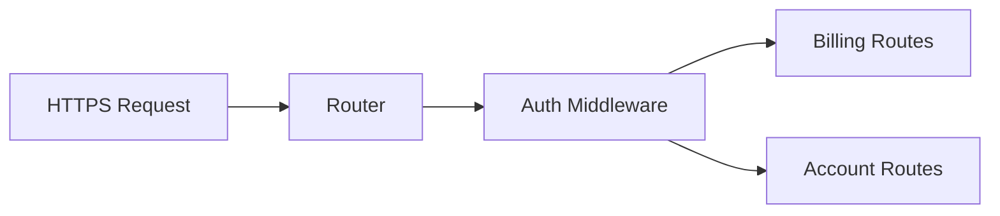

The API gateway is the only public surface. It validates JWT tokens via the
auth service, then forwards the request to the appropriate downstream
subsystem.

```mermaid
flowchart LR
    Inbound[HTTPS Request] --> Router[Router]
    Router --> Authn[Auth Middleware]
    Authn --> Billing[Billing Routes]
    Authn --> Account[Account Routes]

    click Inbound call navigate("./overview.md")
    click Router call navigate("./overview.md")
    click Authn call navigate("./auth.md")
    click Billing call navigate("./billing.md")
    click Account call navigate("./auth.md")
```
