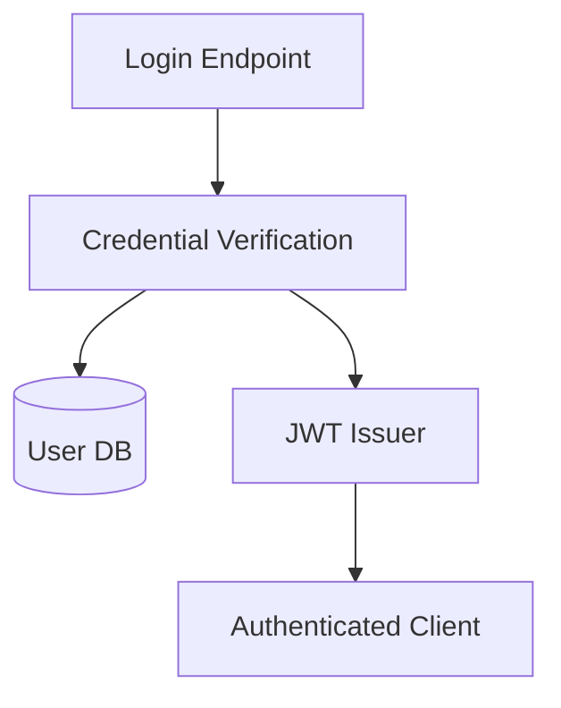

Auth issues short-lived JWTs after verifying credentials against the user
database. Login orchestration lives in `src/auth/login.ts`; credential lookup
and token signing are split into their own modules.

## Source

- [src/auth/login.ts](./src/auth/login.ts) — the login flow: lookup, verify, issue.
- [src/auth/users.ts](./src/auth/users.ts) — user lookup and password verification.
- [src/auth/jwt.ts](./src/auth/jwt.ts) — session token issuing.
