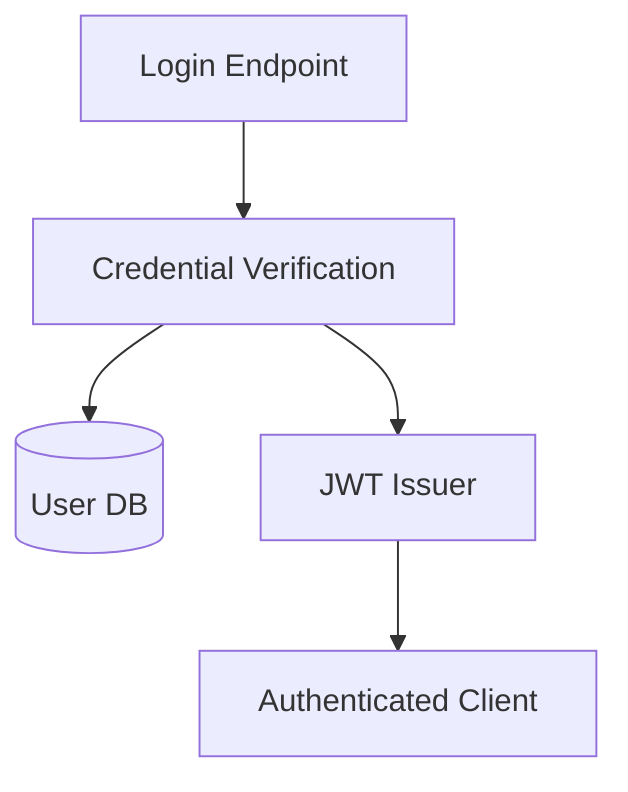

Auth issues short-lived JWTs after verifying credentials against the user
database. Login is implemented in `src/auth/login.ts`.

```mermaid
flowchart TD
    Login[Login Endpoint] --> Verify[Credential Verification]
    Verify --> UserDB[(User DB)]
    Verify --> Token[JWT Issuer]
    Token --> Client[Authenticated Client]

    click Login call navigate("./src/auth/login.ts")
    click UserDB call navigate("./overview.md")
```
