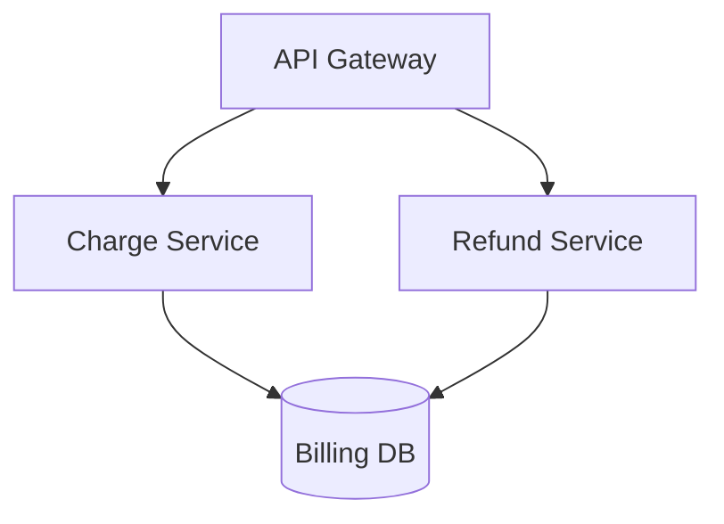

The billing subsystem owns all money-moving operations. It depends on auth
for user identity and emits events to the analytics pipeline.

```mermaid
flowchart TD
    API[API Gateway] --> Charge[Charge Service]
    API --> Refund[Refund Service]
    Charge --> DB[(Billing DB)]
    Refund --> DB

    click Charge call navigate("./charge-flow.md")
    click Refund call navigate("./src/billing/refund.ts")
```
