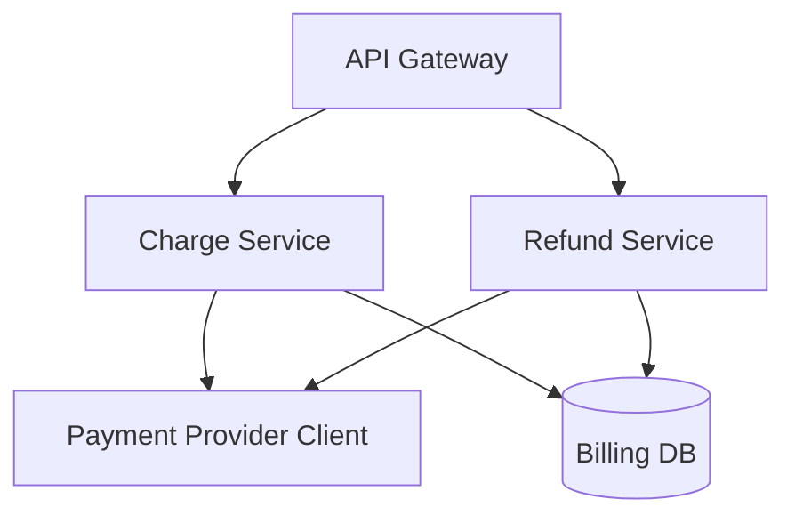

The billing subsystem owns all money-moving operations. It depends on auth
for user identity and emits events to the analytics pipeline. Both charge and
refund go through the shared payment-provider client and persist via the
billing repository.

## Source

- [src/billing/charge.ts](./src/billing/charge.ts) — charge workflow (see [charge flow](./charge-flow.md)).
- [src/billing/refund.ts](./src/billing/refund.ts) — refund workflow.
- [src/billing/provider.ts](./src/billing/provider.ts) — external payment-provider client.
- [src/billing/db.ts](./src/billing/db.ts) — charge/refund persistence.
