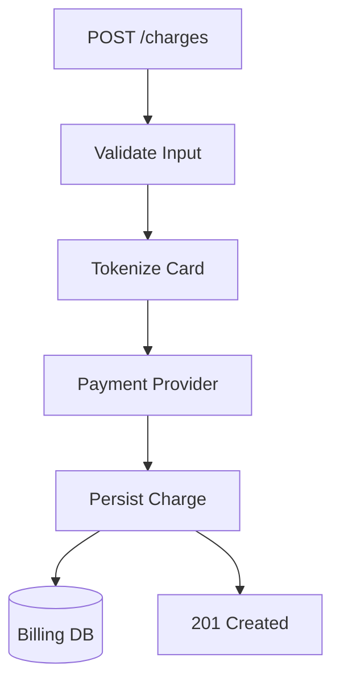

The full charge flow lives in `src/billing/charge.ts`. The diagram below shows
the call chain — click the highlighted node to jump to the source.

```mermaid
flowchart TD
    Req[POST /charges] --> Validate[Validate Input]
    Validate --> Token[Tokenize Card]
    Token --> Provider[Payment Provider]
    Provider --> Persist[Persist Charge]
    Persist --> DB[(Billing DB)]
    Persist --> Resp[201 Created]

    click Persist call navigate("./src/billing/charge.ts")
```
