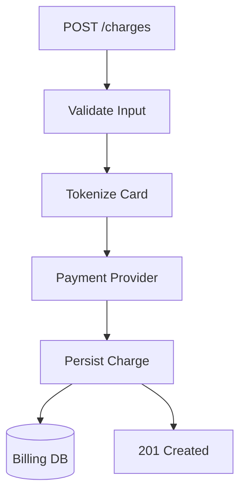

The full charge flow lives in `src/billing/charge.ts`. The diagram below shows
the call chain — click any node to jump to the code that implements it.

```mermaid
flowchart TD
    Req[POST /charges] --> Validate[Validate Input]
    Validate --> Token[Tokenize Card]
    Token --> Provider[Payment Provider]
    Provider --> Persist[Persist Charge]
    Persist --> DB[(Billing DB)]
    Persist --> Resp[201 Created]

    click Req call navigate("./api.md")
    click Validate call navigate("./src/billing/charge.ts")
    click Token call navigate("./src/billing/charge.ts")
    click Provider call navigate("./src/billing/provider.ts")
    click Persist call navigate("./src/billing/charge.ts")
    click DB call navigate("./src/billing/db.ts")
    click Resp call navigate("./billing.md")
```
