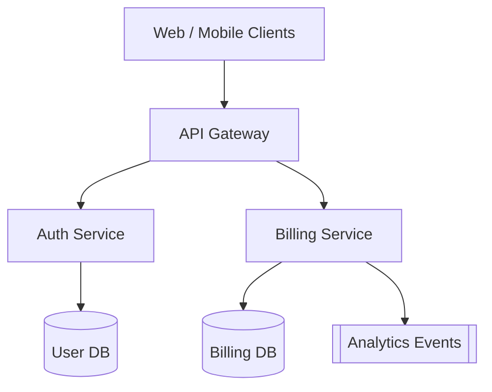

This example shows a small e-commerce backend split into three subsystems: API
gateway, billing, and authentication. Every node links somewhere — subsystems
drill into more detailed diagrams, and the leaves land on source code. Try the
agent panel too: ask it to change something and watch it edit the diagrams
before the code.

