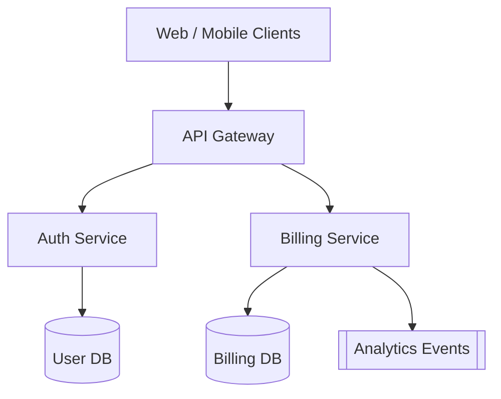

This example shows a small e-commerce backend split into three subsystems: API
gateway, billing, and authentication. Each block on the diagram links to a more
detailed diagram or to the source code.

