Codeswim is an Electron desktop app for navigating a codebase as a hierarchy
of mermaid diagrams. The user picks a workspace folder; the app reads the
`.md` files in it, renders their mermaid blocks, and lets `click` handlers
in those diagrams navigate to other diagrams or to source files. An
optional agent harness (an `opencode` sidecar) lets the user edit diagrams
and code through a chat panel, gated so diagrams are always touched first.

```mermaid
flowchart TD
    User([User]) --> Renderer[Renderer<br/>React UI]
    Renderer <--> Preload[Preload Bridge<br/>contextBridge]
    Preload <--> Main[Main Process<br/>filesystem, IPC, scripts]
    Main --> FS[(Workspace files)]
    Main --> Sidecar[Agent Harness<br/>opencode sidecar]
    Renderer --> Coverage[Coverage<br/>checker]
    Renderer --> Commit[Prompt Commits<br/>synthesized messages]
    Commit --> Main
    Sidecar -.->|edits| FS

    click User call navigate("./overview.md")
    click FS call navigate("./overview.md")
    click Renderer call navigate("./architecture/renderer.md")
    click Preload call navigate("./architecture/preload.md")
    click Main call navigate("./architecture/main-process.md")
    click Sidecar call navigate("./architecture/agent-harness.md")
    click Coverage call navigate("./architecture/coverage.md")
    click Commit call navigate("./architecture/prompt-commits.md")
```

## Subsystems

- [Main process](./architecture/main-process.md) — owns the filesystem, IPC handlers, chokidar watcher, and the npm script runner.
- [Preload bridge](./architecture/preload.md) — the typed `window.api` surface that crosses Electron's context isolation boundary.
- [Renderer](./architecture/renderer.md) — the React UI: state, views, panels, mermaid rendering, markdown parsing.
- [Agent harness](./architecture/agent-harness.md) — the `opencode` sidecar plus its diagram-first plugin and chat UI.
- [Coverage](./architecture/coverage.md) — the diagram/source drift checker that this very file is meant to satisfy.
- [Prompt Commits](./architecture/prompt-commits.md) — the Commit side-panel that synthesizes the prompt-that-regenerates-the-diff as the commit message, gated on coverage.

## Conventions

These files cut across subsystems and aren't owned by any one architecture doc:

- `apps/desktop/src/renderer/index.html` — renderer entry HTML; sets the CSP that mermaid loose-mode needs.
- [apps/desktop/src/renderer/src/main.tsx](apps/desktop/src/renderer/src/main.tsx) — React mount point.
- [apps/desktop/src/renderer/src/env.d.ts](apps/desktop/src/renderer/src/env.d.ts) — Vite client + `window.api` type augmentation for the renderer.
- [apps/desktop/src/renderer/src/browser-stub.ts](apps/desktop/src/renderer/src/browser-stub.ts) — no-op `window.api` for running the renderer outside Electron (Playwright, UI review).
- `apps/desktop/src/renderer/src/assets/main.css` — global styles.
- `apps/desktop/src/renderer/src/assets/codeswim.svg` — app logo.
- [party/codeswim.ts](party/codeswim.ts) — party-mode easter egg (confetti, etc.).

## Testing

Vitest tests live next to the modules they cover:

- [packages/domain-skills/src/skills.test.ts](packages/domain-skills/src/skills.test.ts) — covers the main-process skills indexer.
- [packages/domain-git/src/git.test.ts](packages/domain-git/src/git.test.ts) — covers the git status/branch porcelain parsers.
- [apps/desktop/src/renderer/src/parse.test.ts](apps/desktop/src/renderer/src/parse.test.ts) — covers the markdown/mermaid parser.
- [apps/desktop/src/renderer/src/path-utils.test.ts](apps/desktop/src/renderer/src/path-utils.test.ts) — covers relative path resolution.
- [apps/desktop/src/renderer/src/skill-frontmatter.test.ts](apps/desktop/src/renderer/src/skill-frontmatter.test.ts) — covers the skill frontmatter helpers.
- [apps/desktop/src/renderer/src/ansi.test.ts](apps/desktop/src/renderer/src/ansi.test.ts) — covers the ANSI/SGR terminal-output parser.
- [packages/commit/src/synthesize.test.ts](packages/commit/src/synthesize.test.ts) — covers the commit-message synthesis prompt builder, parser, and trailers.
- [packages/commit/src/triage.test.ts](packages/commit/src/triage.test.ts) — covers the triage prompt builder and sync-plan parser.
- [packages/harness/src/tool/kanban-add.test.ts](packages/harness/src/tool/kanban-add.test.ts) — covers the kanban_add tool (board read, card append, write).

## Build & tooling

- [apps/desktop/electron.vite.config.ts](apps/desktop/electron.vite.config.ts) — electron-vite config for main, preload, and renderer bundles.
- [apps/desktop/vitest.config.ts](apps/desktop/vitest.config.ts) — vitest config (jsdom for the renderer-side tests).
- [eslint.config.mjs](eslint.config.mjs) — flat-config ESLint setup.
- [apps/desktop/scripts/build-harness.mjs](apps/desktop/scripts/build-harness.mjs) — esbuild step that bundles `packages/harness/src/` into `out/harness/` so the sidecar can load it as a single `file://` plugin.
- [scripts/probe-skills.mjs](scripts/probe-skills.mjs) — dev helper that prints the skill index the main process would see.
- [scripts/smoke-link-folder.mjs](scripts/smoke-link-folder.mjs) — smoke test that drives `pick-folder` end-to-end.
- [scripts/test-events.mjs](scripts/test-events.mjs) — dev helper for exercising the watcher's `file-changed` / `tree-changed` events.

## Project docs

- [README.md](README.md) — what codeswim is and how to run it.
- [SIGNING.md](SIGNING.md) — how to produce a signed + notarized macOS build for release.
- [plan.md](plan.md) — the thesis: as AI writes more code, humans should navigate intentional diagrams instead of generated implementation.
- [AGENTS.md](AGENTS.md) — guidance for AI agents working in this repo.
- [CLAUDE.md](CLAUDE.md) — Claude Code project instructions (process layout, gotchas, "don'ts").
- [todos.md](todos.md) — ongoing work notes.
- [philosphy.md](philosphy.md) — design philosophy: two-panel loop, MDD principles, attention-based design.

## Example fixture

- [examples/sample-architecture/overview.md](examples/sample-architecture/overview.md) — a hand-authored codeswim-style hierarchy ("Triage" billing app) used to develop and demo against. Self-contained: its own overview, architecture docs, and `src/` tree.
