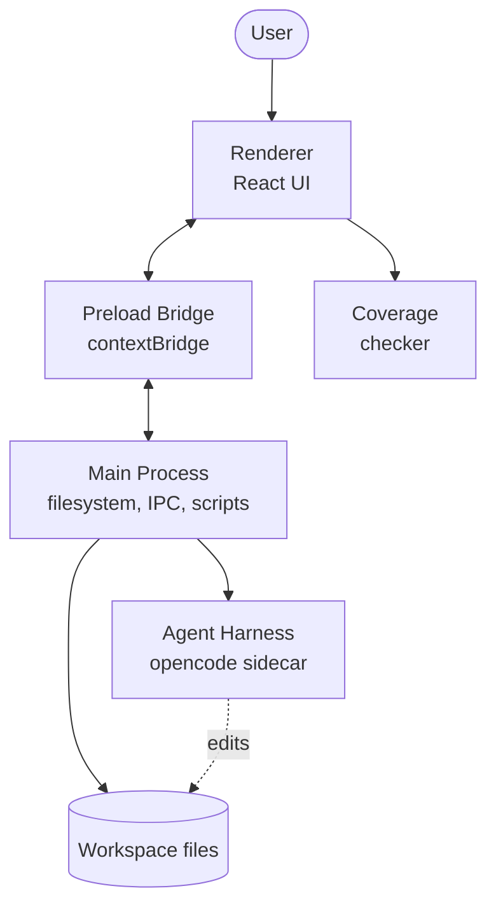

Codeswim is an Electron desktop app for navigating a codebase as a hierarchy
of mermaid diagrams. The user picks a workspace folder; the app reads the
`.md` files in it, renders their mermaid blocks, and lets `click` handlers
in those diagrams navigate to other diagrams or to source files. An
optional agent harness (an `opencode` sidecar) lets the user edit diagrams
and code through a chat panel, gated so diagrams are always touched first.

## Subsystems

- [Main process](./architecture/main-process.md) — owns the filesystem, IPC handlers, chokidar watcher, and the npm script runner.
- [Preload bridge](./architecture/preload.md) — the typed `window.api` surface that crosses Electron's context isolation boundary.
- [Renderer](./architecture/renderer.md) — the React UI: state, views, panels, mermaid rendering, markdown parsing.
- [Agent harness](./architecture/agent-harness.md) — the `opencode` sidecar plus its diagram-first plugin and chat UI.
- [Coverage](./architecture/coverage.md) — the diagram/source drift checker that this very file is meant to satisfy.

## Conventions

These files cut across subsystems and aren't owned by any one architecture doc:

- [src/renderer/index.html](src/renderer/index.html) — renderer entry HTML; sets the CSP that mermaid loose-mode needs.
- [src/renderer/src/main.tsx](src/renderer/src/main.tsx) — React mount point.
- [src/renderer/src/env.d.ts](src/renderer/src/env.d.ts) — Vite client + `window.api` type augmentation for the renderer.
- [src/renderer/src/browser-stub.ts](src/renderer/src/browser-stub.ts) — no-op `window.api` for running the renderer outside Electron (Playwright, UI review).
- [src/renderer/src/assets/main.css](src/renderer/src/assets/main.css) — global styles.
- [src/renderer/src/assets/codeswim.svg](src/renderer/src/assets/codeswim.svg) — app logo.

## Testing

Vitest tests live next to the modules they cover:

- [src/main/skills.test.ts](src/main/skills.test.ts) — covers the main-process skills indexer.
- [src/renderer/src/parse.test.ts](src/renderer/src/parse.test.ts) — covers the markdown/mermaid parser.
- [src/renderer/src/path-utils.test.ts](src/renderer/src/path-utils.test.ts) — covers relative path resolution.
- [src/renderer/src/skill-frontmatter.test.ts](src/renderer/src/skill-frontmatter.test.ts) — covers the skill frontmatter helpers.

## Build & tooling

- [electron.vite.config.ts](electron.vite.config.ts) — electron-vite config for main, preload, and renderer bundles.
- [vitest.config.ts](vitest.config.ts) — vitest config (jsdom for the renderer-side tests).
- [eslint.config.mjs](eslint.config.mjs) — flat-config ESLint setup.
- [scripts/build-harness.mjs](scripts/build-harness.mjs) — esbuild step that bundles `src/harness/` into `out/harness/` so the sidecar can load it as a single `file://` plugin.
- [scripts/probe-skills.mjs](scripts/probe-skills.mjs) — dev helper that prints the skill index the main process would see.
- [scripts/smoke-link-folder.mjs](scripts/smoke-link-folder.mjs) — smoke test that drives `pick-folder` end-to-end.
- [scripts/test-events.mjs](scripts/test-events.mjs) — dev helper for exercising the watcher's `file-changed` / `tree-changed` events.

## Project docs

- [README.md](README.md) — what codeswim is and how to run it.
- [plan.md](plan.md) — the thesis: as AI writes more code, humans should navigate intentional diagrams instead of generated implementation.
- [pros-cons.md](pros-cons.md) — trade-offs of the diagram-first approach.
- [AGENTS.md](AGENTS.md) — guidance for AI agents working in this repo.
- [CLAUDE.md](CLAUDE.md) — Claude Code project instructions (process layout, gotchas, "don'ts").
- [todos.md](todos.md) — ongoing work notes.

## Example fixture

- [examples/sample-architecture/overview.md](examples/sample-architecture/overview.md) — a hand-authored codeswim-style hierarchy ("Triage" billing app) used to develop and demo against. Self-contained: its own overview, architecture docs, and `src/` tree.
