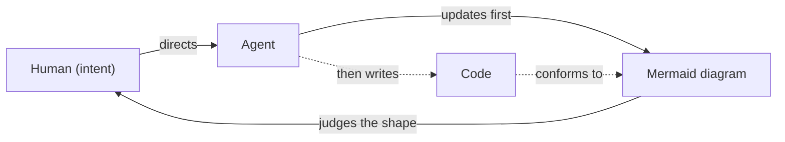

# Design Philosophy

> An IDE built around a single feedback loop. You do not write code — agents do. You direct, and you read the system as a living diagram. You act, you see the result, you act again. Everything else is noise competing for the attention you're trying to give your work.

---

## The problem we are solving

Modern editors are maximally flexible: unlimited panels, plugins, windows, docks. Every panel is "free" to add, so people add them — file tree, terminal, minimap, problems tray, source control, outline, breadcrumbs. The cumulative cost is invisible until you notice you're writing code in a small square in the middle of the screen, surrounded by chrome you rarely look at.

The failure isn't any single panel. It's that flexibility has no forcing function to ever *remove* anything. Every persistent panel pays rent on your screen and your attention whether or not you're using it. Flexibility became clutter.

This project is the opposite bet: **constraint as a feature.** We do not let you accumulate. We make you choose.

---

## The core principle: two panels are one loop

There is a hard cap of **two persistent panels**, and the two are not arbitrary. They are the two halves of a feedback loop:

- **Control** — where you act on the system. Edit, command, direct the agent.
- **View** — where you perceive what the system did. A diagram, a rendered app, command output, a browser.

This maps exactly onto Don Norman's two *gulfs*: the **gulf of execution** (how do I act on this thing?) and the **gulf of evaluation** (what did my action do?). Good design bridges both. Control bridges execution; View bridges evaluation.

Two is therefore not austerity — it is the **cardinality of a closed loop.** With one panel you are open-loop: acting blind, or watching passively with no way to steer. With three you have fragmented either the acting or the seeing. The minimum viable loop, and the most that stays a *single* loop, is exactly two: an actuator and a sensor.

**Rule:** Any request to add a third persistent panel is reframed, never granted. It becomes either transient UI (summoned and dismissed) or content *inside* Control or View. The cap is the loop, not a preference.

---

## Mermaid driven development

In this project, **humans do not write code. Agents write code.** The human's medium is not text — it is the diagram. You read, reason about, and judge the system as a Mermaid diagram; the source code is an implementation detail the agent owns beneath it. This is what View *shows* and what the human's job *is*.

The ordering is the whole idea: **the diagram updates first.** When a change is made, the diagram changes before the code does. It is not documentation generated *after* the fact — it is the primary artifact the change is expressed and evaluated in. Code conforms to the diagram, not the reverse.

This is why it earns a name. Conventional diagrams rot, because code is the source of truth and the picture is an afterthought that drifts out of sync. Inverting the order kills the rot: a diagram cannot fall behind the code if the code is written to satisfy the diagram.

Intellectually this is a lightweight, agent-powered species of **model-driven development** — an old idea that even shares the initials (MDD already stands for *Model*-Driven Development, a fitting collision). It struggled for decades on one problem: keeping an abstract model and concrete code in sync required either rigid code generation or painful round-tripping, so the model always decayed into stale decoration. **The agent is the missing compiler.** It translates diagram-level intent into code flexibly, fills the gaps the diagram leaves implicit, and keeps the two in sync without a brittle generator. Model-driven development lacked an intelligent compiler for forty years; the agent is that compiler.

It also makes two earlier commitments literal:

- The diagram **is** the compressed evaluation surface — no longer one option among many, but the primary surface of the entire system.
- "The diagram updates first" **is** checkpoints-over-streams — the diagram is the settled state you judge before the agent commits to code. Approving the shape is approving the plan.

### The central risk: a diagram is lossy

A diagram shows structure and flow. It does not show the logic inside a node, the edge case, the race condition, the performance cliff. If the human only ever sees the diagram, a whole class of behavior lives *below the resolution of the picture* — and **you cannot evaluate what the representation does not render.** The diagram is necessary for judgment; it is not automatically sufficient.

Diagram-first must therefore never become diagram-*only*. Two mitigations, both already in the philosophy:

- **Resolution, through switching not splitting.** A system is not one diagram but a family at many levels — architecture, module, function-level flow, state. The View switches between these to match the resolution of the change being judged, exactly as it switches any other contents. One diagram at a time, at the level the change lives in.
- **A deliberate drop to ground truth.** There must be a summoned, intentional path from the diagram to the actual code or a running test, for when the shape is not enough to judge safely.

---

## Persistent versus transient

The two-panel cap only works because almost everything else stops being a panel and becomes something you *summon*.

- The file tree is a fuzzy-finder you call up and dismiss, not a dock.
- The terminal is an overlay or a View state, not a permanent strip.
- Errors are inline or a peek, not a docked tray.

We **switch, we do not split.** A surface that swaps its contents in a fixed location beats a new window that appears somewhere new each time — the fixed location preserves spatial memory and muscle memory even as the contents change.

This is progressive disclosure: show what is needed now, keep the rest one gesture away.

---

## Attention is the scarce resource

The deepest commitment of this project is not about screen space. It is about attention.

Two contemplative ideas anchor it. One-pointedness (*ekaggatā*) teaches that focus is reached by **release**, not addition — you concentrate by continually letting go of what isn't the object and returning. Our switch mechanizes exactly that: to bring up one thing you must let go of another. Zen's "do one thing" teaches **wholeness of the present act** — it forgives *sequence* but condemns *divided attention*. Switching to the terminal and being fully at the terminal is doing one thing. Half-watching a log scroll while typing is two things, neither whole.

From this follows the rule that does the most work in practice:

**Ban ambient attention-bait.** No notification badges. No counters ticking upward. No logs scrolling at the edge of sight. No panel dimmed-but-still-present. When something is not the one thing, it should be **absent, not lurking.** A switch is total — the surface you left does not linger ghosted at the margin, tugging.

And a piece of honesty that should shape every feature decision: a tool cannot *give* anyone focus — presence belongs to the practitioner, not the spoon. What a tool *can* do is stop seducing attention into fragments. That is the mission, stated plainly:

> We do not make you focus. We stop competing for the attention you are trying to give your work.

---

## The agent in the loop

When the agent does the acting, you shift from **doer to supervisor**, and the structure changes in ways we design around explicitly.

**The gulf of evaluation widens.** Reconstructing what someone else did is harder than recalling what you did. So View must work *harder* in an agentic IDE than in a manual one. Prefer **compressed evaluation surfaces** — a Mermaid diagram that shows the *shape* of a change at a glance — over raw exhaustive output. The supervisor's job is judgment, and judgment needs compression.

**Visual weight inverts.** In a manual editor the control panel is large and the preview is a sliver. Once the agent does the typing, the ratio flips: **View becomes the panel you live in, Control shrinks to a command strip.** You are mostly evaluating now, not authoring.

**Loops nest.** The agent runs a tight inner loop — change, check (often in a browser), adjust. You run an outer loop wrapped around it — direct, then evaluate. They share one sensor: the View. Your loop *contains* the agent's loop.

**The agent is in the loop, not on the stage.** Watching the agent work in real time is seductive and it is a trap — it is neither acting nor clean evaluation, just hovering, attention smeared across a loop still in flight. So: **hide the agent's inner loop by default.** Let its browser be a silent scratch surface while it works, and let it surface to you only at a checkpoint, settled, in a "here is the result — judge it" state. Show the human settled states to evaluate, not live process. Checkpoints over streams.

---

## Legibility: no invisible modes

A surface that changes what it holds is, technically, a *mode* — and modes cause errors only when they are invisible. Two rules keep the cost near zero:

1. **The View always announces what it is.** Agent-working versus human-reviewing; diagram versus browser versus output. The one unforgivable ambiguity is not knowing whether the browser in front of you is the agent's live fumbling or the finished state you are meant to sign off on. A working surface and a verdict surface must not look alike.

2. **The switch is sacred.** This whole philosophy moves complexity out of the panels and into the act of switching (Tesler's Law: complexity is conserved, only relocated). If switching is slow or its target state is unclear, every bit of load you saved comes flooding back through that one chokepoint. Switching must be a single instant gesture, and the resulting state must be obvious at a glance.

---

## The tenets

For strict adherence, the philosophy compresses to these:

1. **Humans don't write code; agents do.** The human's medium is the diagram, not text.
2. **The diagram is the source of truth; code is generated to conform to it.** This is what keeps the picture from rotting.
3. **The diagram updates first.** It is the checkpoint where intent is judged before the agent commits to code.
4. **Diagram-first, never diagram-only.** The diagram is lossy — provide resolution (switch diagram levels) and a deliberate drop to ground truth.
5. **Two persistent panels, never three.** The cap is a feedback loop — Control and View — not a style choice.
6. **Switch, don't split.** Surfaces swap contents in a fixed place; they do not multiply or float to new locations.
7. **Persistent is rare; transient is the default.** If it isn't Control or View, it is summoned and dismissed.
8. **No ambient attention-bait.** Absent, not lurking. No badges, counters, peripheral motion, or dimmed-but-present surfaces.
9. **Never break the loop.** Don't let the human act without seeing the consequence; don't show a consequence they can't act on. Act and see stay paired.
10. **The agent is in the loop, not on the stage.** Hide its inner loop; surface settled states at checkpoints, not live process.
11. **Compress the evaluation surface.** Show the shape of a result at a glance before its full detail.
12. **No invisible modes.** Every surface declares its current state; a working surface and a verdict surface must never be confused.
13. **The switch is sacred.** Instant, single-gesture, with an obvious resulting state. If switching is heavy, the whole design fails.

---

## The litmus test for any new feature

Before adding anything, ask in order:

1. **Does it assume the human writes or routinely reads code?** → No. The human works at the diagram; raw code is the agent's medium and a deliberate, summoned exception — not the default surface.
2. **Does it become a third persistent panel?** → No. Make it transient, or make it content of Control or View.
3. **Does it invite divided attention** — something glanced at without being attended to? → No. Make it absent until summoned, or settle it into a checkpoint.
4. **Does it make the human spectate the agent's process** rather than judge its result? → No. Collapse the process; surface the outcome.
5. **Does it add a mode without announcing itself?** → No. Make the state loud, or don't add the mode.

If a feature survives all five, it belongs. If it fails any, it is either reshaped to fit the loop — or it is the wrong feature.